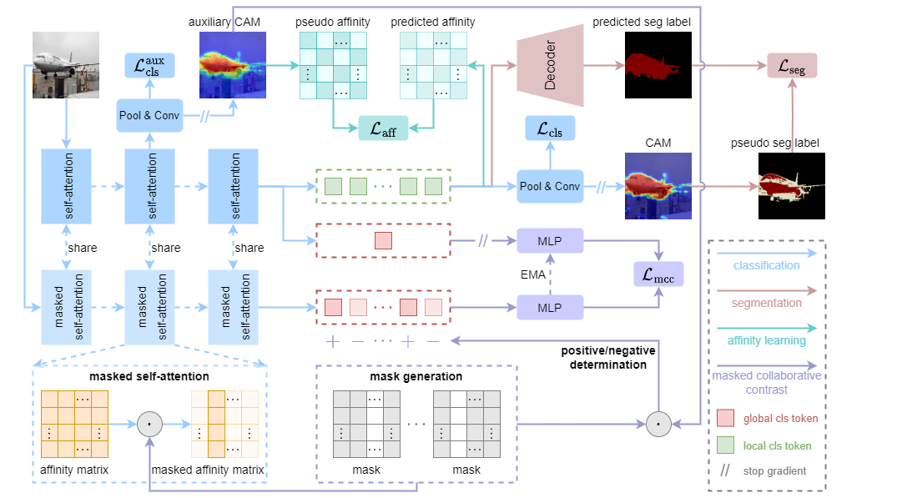

## [Masked Collaborative Contrast for Weakly Supervised Semantic Segmentation](https://arxiv.org/abs/2305.08491)

## Abstract
This study introduces an efficacious approach, Masked Collaborative Contrast (MCC), to emphasize semantic regions in weakly supervised semantic segmentation. MCC adroitly incorporates concepts from masked image modeling and contrastive learning to devise Transformer blocks that induce keys to contract towards semantically pertinent regions. Unlike prevalent techniques that directly eradicate patch regions in the input image when generating masks, we scrutinize the neighborhood relations of patch tokens by exploring masks considering keys on the affinity matrix. Moreover, we generate positive and negative samples in contrastive learning by utilizing the masked local output and contrasting it with the global output. Elaborate experiments on commonly employed datasets evidences that the proposed MCC mechanism effectively aligns global and local perspectives within the image, attaining impressive performance.
<div align="center">
<br>
  
</div>

## Data Preparations

### VOC dataset

#### 1. Download

``` bash
wget http://host.robots.ox.ac.uk/pascal/VOC/voc2012/VOCtrainval_11-May-2012.tar
tar –xvf VOCtrainval_11-May-2012.tar
```
#### 2. Download the augmented annotations
The augmented annotations can be downloaded from [SBD dataset](https://www.dropbox.com/s/oeu149j8qtbs1x0/SegmentationClassAug.zip?dl=0). After downloading ` SegmentationClassAug.zip `, you should unzip it and move it to `VOCdevkit/VOC2012`. 

``` bash
VOCdevkit/
└── VOC2012
    ├── Annotations
    ├── ImageSets
    ├── JPEGImages
    ├── SegmentationClass
    ├── SegmentationClassAug
    └── SegmentationObject
```

### COCO dataset

#### 1. Download
``` bash
wget http://images.cocodataset.org/zips/train2014.zip
wget http://images.cocodataset.org/zips/val2014.zip
```
Unzip and place train and validation images under VOC directory structure style.

``` bash
MSCOCO/
├── annotations
├── JPEGImages
│    ├── train2014
│    └── val2014
└── SegmentationClass
     ├── train2014
     └── val2014
```

#### 2. Generating VOC style segmentation labels for COCO
To generate VOC style segmentation labels for COCO dataset, use [parse_coco.py](./datasets/parse_coco.py).
```bash
python ./datasets/parse_coco.py --split train --year 2014 --to-voc12 false --coco-path $coco_path
python ./datasets/parse_coco.py --split val --year 2014 --to-voc12 false --coco-path $coco_path
```

## Create environment

### Clone this repo

```bash
git clone https://github.com/fwu11/mcc.git
cd mcc
```

### Install the dependencies
``` bash 
conda create -n py38 python==3.8
conda activate py38
conda install pytorch==1.10.1 torchvision==0.11.2 cudatoolkit=11.3 -c pytorch -c conda-forge
pip install -r requirement.txt
```

### Build Reg Loss

To use the regularized loss, download and compile the python extension, see [Here](https://github.com/meng-tang/rloss/tree/master/pytorch#build-python-extension-module).

### Create softlinks to the datasets

```bash
ln -s $your_dataset_path/VOCdevkit VOCdevkit
ln -s $your_dataset_path/MSCOCO MSCOCO
```

## Train
```bash
## for VOC
CUDA_VISIBLE_DEVICES="0,1,2,3" python -m torch.distributed.launch --nproc_per_node=4 --master_port=29501 scripts/dist_train_voc_seg_neg.py --work_dir work_dir_voc --spg 1
## for COCO
CUDA_VISIBLE_DEVICES="0,1,2,3,4,5,6,7" python -m torch.distributed.launch --nproc_per_node=8 --master_port=29501 scripts/dist_train_coco_seg_neg.py --work_dir work_dir_coco --spg 1
```
## Evalution
```bash
## for VOC
python tools/infer_seg_voc.py --model_path $model_path --backbone vit_base_patch16_224 --infer val
## for COCO
CUDA_VISIBLE_DEVICES="0,1,2,3,4,5,6,7" python -m torch.distributed.launch --nproc_per_node=8 --master_port=29501 tools/infer_seg_voc.py --model_path $model_path --backbone vit_base_patch16_224 --infer val
```

## Results
Here we report the performance on VOC and COCO dataset. `MS+CRF` denotes multi-scale test and CRF processing.

|Dataset|Backbone|*val*|Log|Weights|*val* (with MS+CRF)|*test* (with MS+CRF)|
|:---:|:---:|:---:|:---:|:---:|:---:|:---:|
|VOC|DeiT-B|68.8|[log](./logs/mcc_deit-b_voc_20k.log)|[weights](https://drive.google.com/file/d/1S_Hsrts-WEQeUZqyyQx2buAsxPNeggPp/view?usp=drive_link)|70.3|71.2|
|COCO|DeiT-B|41.1|[log](./logs/mcc_deit-b_coco_80k.log)|[weights](https://drive.google.com/drive/folders/1BZJoY7U1GhtvDR7vdjDfgBJZZWFUbnMC?usp=share_link)|42.3|--|

## Citation
``` bibtex
@misc{wu2023masked,
      title={Masked Collaborative Contrast for Weakly Supervised Semantic Segmentation}, 
      author={Fangwen Wu and Jingxuan He and Lechao Cheng and Yufei Yin and Yanbin Hao and Gang Huang},
      year={2023},
      eprint={2305.08491},
      archivePrefix={arXiv},
      primaryClass={cs.CV}
}
```

## Acknowledgement
Our code is developed based on [ToCo](https://github.com/rulixiang/ToCo). Also, we use the [Regularized Loss](https://github.com/meng-tang/rloss) and [DenseCRF](https://github.com/lucasb-eyer/pydensecrf.git). We appreciate their great work.
